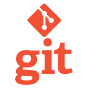

# What is git

> GIT – Global Information Tracker

This is not a coding language, but it is a way (the most common way) to manage our code

Git tracks any changes you make in your code and it allows you to manage those changes and share your code with others

Git is created by Linus Torvalds

The guy who wrote the original linux kernel and git was developed for helping with the development of linux

He gave Git the name because of the british meaning of the word.
(an unpleasant or contemptible person.)
However the official readme file of the git repository calls the system "Global Information Tracker"

Git itself does not have a GUI or a web interface, it is completely command line based, however:

* GitHub is the most well known web based system that hosts git repositories and has recently been acquired by Microsoft.

* Bitbucket (owned by Atlassian) and Gitlab (an open source self hosted option) are others that have a wide reach.

# How does git work

Before having a look at git, let’s have a quick look at what it does.

The features that git offers are not always easy to get your head around.
While we may see “managing code” as a way to save our code, if that is all we do then Git is a cumbersome way to do so.

A USB drive would be a lot easier

With Git we can do so much more!

Within Managing Code we can do:

| Feature | Description | 
| :--- | :--- |
| Branches | Using **Branches** we can create features and fix bugs without directly affecting your main code |
| Partial Commits | Using **Partial Commits** we can create a more detailed history |
| Decentralised Development | Git does not rely on a central server for you to work on. |
| Share your code | You can give your code to someone else, but they can only submit changes to it if you give them access to it |
| Multiple Devices, Multiple Locations | You are no longer limited to the machine in your office |

Some features are implemented by 3rd party products:

| Feature | Description |
| :--- | :--- |
| Pull Requests | When you have worked on some code from someone else, you will need to notify the owner or a contributor, this is done using a pull request. | 
| Public and Private Repositories | If you want to clone a repository without the owners knowledge, the repository has to be public, otherwise you need to be given access. |

# The master branch

The master branch is a what is first created when you do your first commit. When starting to learning git you will be ok to just use this, but as soon as you start working in a team or have something that is in production (i.e. something people can see and work with) you will want to start exploring working with branches.

# Tracking Files - Not Folders

Git tracks files, not folders

So when you setup your folder structure for a project, make sure there is a file in there so git can create a path to that file.

If a path to a file includes a folder, it will store those folders

If you don’t have a file for a folder yet, create a file can call it .gitkeep 
This can be deleted later on if need be, but won’t cause issues if you leave it in there

# Git and Windows

Although git's origin lie in linux, macOS and Windows have the use of git deep baked into their development cycles.

All common IDE's and most code editors have git build right in, or else there are plenty of tools that can help you out.

First we are going to look at the commands using the command line, so that when you explore the GUI options, you will be familiar with the terminology.
