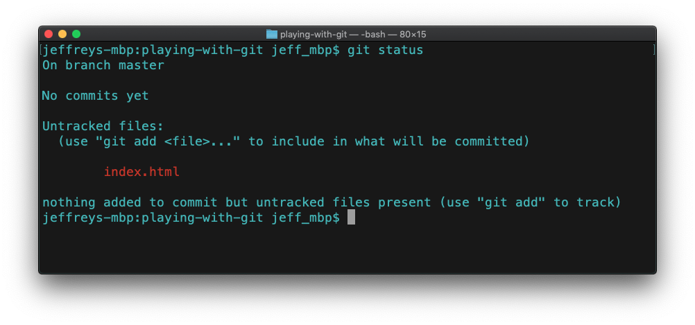
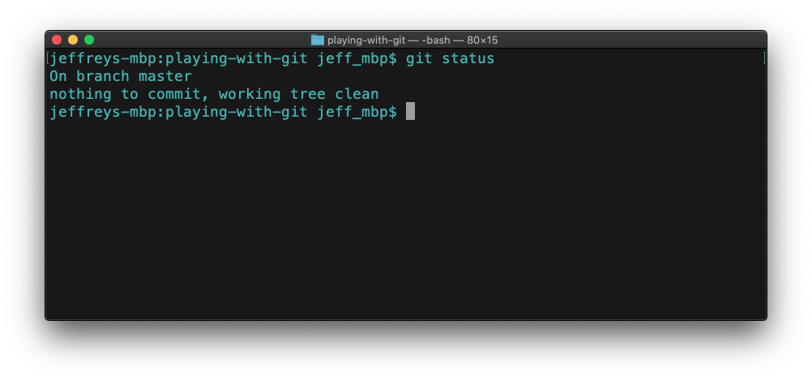

# Git stages

## Working Directory

When we code, we are working in a folder, this folder is called the working directory

You can save your work in this folder, but a normal save won’t add it to the repository. If you delete that file - it is gone, just like a normal file would be.

When using the command git status you can see that the files are listed in red

# Staging Stage

The staging area lists the files in green

When the files are in the staging area, they are being setup to be committed into the repository

Once they are committed into the repository they are tracked and you will be able to see the changes from the previous commit.

# Commit Stage

Once you have committed the files they are part f the repository and any future changes are able to be compared to what is currently in the repository

After you make the first commit, the master branch is created and that is the branch that all other changes will be based off

# Git Log

When we do a git log command we see the numbers appear

This is very handy to authenticate our code, but also to go back to previous commits if we need to

