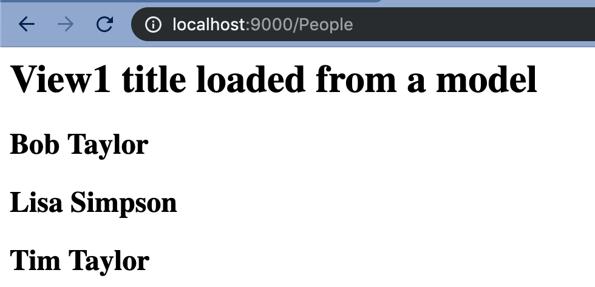

# Loading your database

Create a **data.sql** file and place it in the **sql** folder.
When you have created that file copy the following into it:

!!! note "SQL Code"
    ``` sql
    use containerdb;

    CREATE TABLE IF NOT EXISTS tbl_people (

        ID INT(11) AUTO_INCREMENT,
        FNAME VARCHAR(20) NOT NULL,
        LNAME VARCHAR(30) NOT NULL,   
        DOB DATE NOT NULL,
        PRIMARY KEY (ID)
    ) AUTO_INCREMENT = 1;

    INSERT INTO tbl_people (FNAME, LNAME, DOB) VALUES ('Bob', 'Taylor', '1954-04-01');
    INSERT INTO tbl_people (FNAME, LNAME, DOB) VALUES ('Lisa', 'Simpson', '2010-03-23');
    INSERT INTO tbl_people (FNAME, LNAME, DOB) VALUES ('Tim', 'Taylor', '1968-11-10');

    use containerdb;

    SELECT * FROM tbl_people;
    ```

To able to add the code to the database, you will need to connect to the database first. To do that, make sure you have the extensions from above installed and do the following:

??? note "Connect to the MySQL Database"
    1. In the left bar expand the MySQL section and click on the plus button

    

    2. In the pop up at the top of the screen you will see an area when you can type in the host.

    

    3. 1. If you are using Docker Toolbox type in `192.168.99.100`

    

    3. 2. If you are using Docker native type in `localhost`

    

    4. Next type in the username to the database, in this case is `user`

    

    5. Next type in the password to the database, in this case is `user1234`

    

    6. Next the port will be set to 3306 - leave this alone

    

    7. Next the path to the certificate will be blank - leave this alone

    

    8. The connection should now show up in the left panel of vscode.

Once you have the database connection setup, open the **data.sql** that has the database code in it and right-click on an empty area in the code window and select **Run MySQL Query**

If you have done all of this correctly, a side panel will open up and show you the following:

| ID | FNAME | LNAME | DOB |
| :--- | :--- | :--- | :---
| 1 | Bob	| Taylor	| Thu Apr 01 1954 00:00:00 GMT+1300 (NZDT) | 
| 2 | Lisa  | Simpson   | Tue Mar 23 2010 00:00:00 GMT+1300 (NZDT) | 
| 3 | Tim	| Taylor	| Sun Nov 10 1968 00:00:00 GMT+1300 (NZDT) | 

## Updating the Model

In the model we can create a new function that returns data from the database. We don't need any parameters for this, so it will just be a simple `SELECT` statement.

First we need to establish the connection to the database, add the following code right below the class declaration

!!! note ""
    ```
    private $db;

    public function __construct() {
        $this->db = new Database;
    }
    ```

Next update your model with the following code by placing it below the title method:

!!! note ""
    ```
    public function getAllPeople() {
      $this->db->query('SELECT * FROM tbl_people');
      return $this->db->resultSet();
    }
    ```
    
    The function above sends the query to the database and calls the `resultSet()` method, which is defined in the **libraries/Database.php** file

    The datatype this function returns will always be an array - even if it is only an array with a single index.

Adding this function to the controller is exactly the same as what we did with the title, so go to the **People** Controller and update the index action to this:

!!! note "Updated index action"
    ```
    public function index() {

      $title = $this->people->title();
      $allPeople = $this->people->getAllPeople();

      $data = [
        'title' => $title,
        'allPeople' => $allPeople
      ];

      return $this->view('people/view1', $data);
    }
    ```

    Just see how it is the same and the only thing we have added is the variable that calls the `getAllPeople()` function and passed it into the `$data` array.

## Adding the data to the View

Since the content of the `$allPeople` variable is an array, we need to loop through the data.

So back in the `view1.php` file add the following code:

!!! note "Looping through the data"
    ``` php
    echo `<br><br>`; //Only need this to create an empty line.

    $output = "";

    foreach($data['allPeople'] as $people) {
      $output .= '<h2>'.$people['FNAME'].' '.$people['LNAME'].'</h2>';
    }

    echo $output;
    ```

Now when you refresh the page, you will see an database connection error.  
To fix this, change the value of the DBHOST in the `.env` file to `mvcex01_db_1`

The host of the database needs to be whatever your project is called in lower case followed by `_db_1`.

If you refresh your website now, you should see the following:

